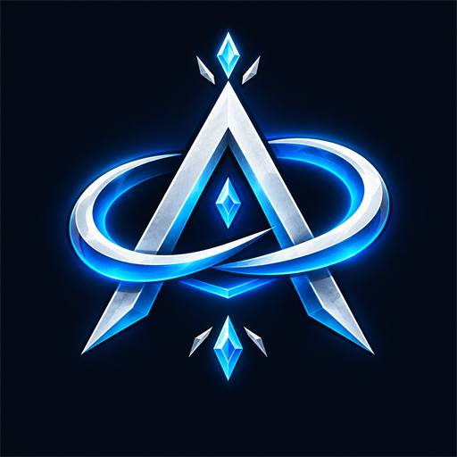

<p align="center"></p>

# AeonUI

Interface et confort pour **WoW Forever** (client 1.60, moteur 12.x, Interface `16001`).
Trente-deux modules activables un par un, **aucune dépendance** (ni Ace, ni ElvUI ; LibStub et LibDeflate sont incluses).
Reprend toutes les fonctions de NaowhUI qui ont un sens sur Forever, réécrites pour ce client.

Addon non officiel, sans lien avec Blizzard Entertainment. World of Warcraft et WoW Forever sont des marques de Blizzard Entertainment.

## Pourquoi pas NaowhUI
NaowhUI ne se charge pas sur Forever (pas de `16001` dans son `.toc`). Son cœur est un
installeur de profils pour ElvUI, Plater, Details, WeakAuras et EllesmereUI, absents ou cassés
ici : sur ce moteur, le journal de combat est interdit aux addons et les valeurs de combat
sont secrètes. AeonUI fait les choses lui-même, dans ces limites.

## Modules
| Module | Ce qu'il fait | Défaut |
|---|---|---|
| **Barre du haut** | Amis et guilde en ligne (listes, AFK/DND), heure 12/24 h + date + « zzz » au repos, or, durabilité, sacs, FPS/latence colorés + mémoire des addons (Maj-clic : libérer), **menu Voyage** (téléportations et portails de mage, Reflet-de-Lune, Rappel astral), **pierre de foyer**. Masquable en combat (FPS/latence peuvent rester visibles). Position haut, bas ou **libre** (largeur ajustée, déplaçable via `/aeon unlock`). Descend la minimap pour ne pas la couvrir (clients sans Edit Mode ; sur Forever, la placer via Edit Mode). Deux emplacements libres (gauche, droite) pour n'importe quel texte d'information. | actif |
| **Sacs** | Une seule fenêtre pour le sac à dos et les sacs équipés, sur son mover : recherche, tri du client, niveau d'objet sur l'équipement, objets gris signalés, bordure de qualité, recharges, emplacements libres et or. Banque Blizzard. | coupé |
| **Utilitaire de raid** | Bouton « Raid » sur son mover, visible en groupe : appel prêt, vérification des rôles, compte à rebours, marqueurs de cible, marqueurs au sol (boutons sécurisés, utilisables en combat). | coupé |
| **Butin** | Fenêtre de butin au thème, sous le curseur ou sur son mover, couleurs de qualité, maître du butin. Barres de jets de groupe (besoin, cupidité, désenchanter, passer) avec temps restant, sur le mover `lootroll`. | coupé |
| **Panneaux de données** | Trois bandeaux libres sur les movers `datapanel1` à `datapanel3`, découpés en 1 à 6 emplacements : coordonnées, quêtes, régénération de mana, vitesse, DPS du compteur natif (si le client l'a), et les textes de la barre du haut (amis, guilde, heure, or, durabilité, sacs, FPS). Masquables en combat. | coupé |
| **Confort automatique** | Réparation (banque de guilde d'abord), vente des gris par lots, **butin rapide**, **quêtes acceptées/rendues** (Maj pour suspendre, jamais de choix de récompense à ta place), maintien ALT pour libérer l'esprit, invitations d'amis/guilde, suppression pré-remplie, cinématiques passées, reset d'instance annoncé. | actif |
| **Rappels** | Hors combat : buff de classe manquant (seulement si tu connais le sort), **posture/forme attendue** (guerrier, druide), familier absent, « Bien nourri » en instance, Forme d'Ombre / Fureur vertueuse (option), durabilité basse, sacs pleins, camouflage oublié (donjons/raids ou partout). Camouflage et posture : texte et couleur personnalisables, son répété à intervalle choisi. | actif |
| **Alertes** | « + Combat / - Combat » (entrée, sortie ou les deux ; textes, couleurs, son et taille réglables), mort d'un membre du groupe (une fois par mort, son et taille propres), chronomètre de combat. | actif |
| **Barres de nom** | Deux chevrons collés à la barre de vie de la cible (hostiles seulement), le gauche s'écarte pendant une incantation. Couleur hors combat, en combat, et quand un autre tank a l'agro. | actif |
| **Cadres de groupe et de raid AeonUI** | Grilles de groupe et de raid : vie, puissance, nom, rôle, chef, marqueur, bordure d'agro et de débuff dissipable par ta classe, atténuation hors de portée ; tri par groupe, classe, rôle ou nom ; nom tronqué ; seuil de raid 5/10/40 ; clic-cible. | coupé |
| **Barres d'action AeonUI** | Six barres déplaçables de boutons Blizzard (icônes, recharges, raccourcis, glisser-déposer par le code Blizzard) : boutons, boutons par ligne, taille, espacement, opacité, visible au survol seulement ; textes de raccourci et de macro masquables ; mode raccourcis `/aeon kb` ; pagination postures et furtivité sur la barre 1. Micro-menu et sacs : cachés, style Blizzard (Edit Mode ou mover) ou style AeonUI (sur leur mover ou dans la barre du haut). | coupé |
| **Minimap AeonUI** | Minimap carrée ou ronde à la taille voulue, bordure au thème, nom de zone (couleur PvP) et coordonnées, zoom à la molette, décor Blizzard caché, boutons d'addons regroupés sous la carte (toujours, au survol, jamais) ; déplaçable. | coupé |
| **Chat AeonUI** | Fenêtres au thème (fond, police, onglets plats, boutons latéraux cachés, sans fondu, historique réglable), historique conservé au /reload, mots-clés surlignés avec son, anti-spam tolérant, URL cliquables, bouton de copie, canaux courts, couleur de classe partout, horodatage, zone de saisie en haut ou en bas. | coupé |
| **Barres de données AeonUI** | Barre d'expérience (repos, cachée au niveau max) et barre de réputation suivie, déplaçables, texte et infobulle ; barres Blizzard cachées. | coupé |
| **Suivi de quêtes AeonUI** | Suivi Blizzard sur un support déplaçable, hauteur réglable, en-têtes au thème, repli automatique en combat ou en instance. | coupé |
| **Cadres Blizzard déplaçables** | Gestionnaire de recharges (essentiel, utilitaire, icônes et barres de buff), buffs et débuffs du joueur sur des movers AeonUI, sans reparentage ; chacun peut rester à Edit Mode. | coupé |
| **Gestionnaire de recharges** | Réglages sort par sort du gestionnaire de recharges Blizzard : choix du sort par icône, afficher ou masquer sur sa barre (les suivants remontent), lueur pulsée quand il est prêt ou en permanence. | coupé |
| **Plaques de nom AeonUI** | Remplace l'habillage Blizzard des plaques : vie (réaction, classe, menace en combat), nom, niveau, barre d'incantation avec icône, marqueur de raid, débuffs et buffs au-dessus, surbrillance de la cible, taille des textes réglable. Compatible avec les chevrons. | coupé |
| **Fiche de personnage** | Niveau d'objet par emplacement (couleur de qualité), niveau moyen, repère « ! » sur les pièces enchantables sans enchantement. Mêmes niveaux sur la fenêtre d'inspection, niveau moyen des joueurs dans leur infobulle. | actif |
| **Habillage** | Fiche de personnage et fenêtre d'amis au thème (option : fond plat, emplacements recadrés, bordure de qualité), panneaux Blizzard sombres (option), infobulles sombres, couleur de classe, masquage en combat (unités ou toutes), icônes de buffs et du gestionnaire de recharges recadrées ; infobulles au curseur, cible de l'unité, rang de guilde, ID de sort, d'objet et d'aura, barre de vie masquable. | actif |
| **Interface épurée** | Erreurs rouges, tête parlante, tutoriels, message de capture masqués ; opacité des alertes de sort, alertes masquées par classe ; barres d'action toujours visibles ; erreurs Lua masquées ; chiffres de recharge natifs sur tous les boutons ; texte de recharge coloré par palier sur les boutons et icônes AeonUI (formateur natif). Toute CVar changée est rendue. | actif |
| **Cadres d'unité** | Retouches des cadres Blizzard : mode sombre, vie à la couleur de classe, noms de raid colorés, épées croisées quand la cible est en combat. | coupé |
| **Cadres d'unité AeonUI** | Remplace les cadres Blizzard du joueur, de la cible, de la cible de la cible, du focus, de la cible du focus, du familier et des boss 1 à 5 par des cadres AeonUI : vie, puissance, barre d'incantation, auras, nom, niveau, repères combat/repos/chef, marqueur de raid, points de combo, totems (barre déplaçable, clic droit pour détruire). Chaque unité a ses réglages (taille, éléments) ; déplaçables via `/aeon unlock`. Voir « Cadres d'unité ». | coupé |
| **Barres de ressources** | Vie (option), puissance, points de combo et mana en forme de druide en barres séparées, chacune sur son mover : largeur, hauteurs, texte, couleur de classe, repère de seuil, visibles toujours ou en combat / cible hostile, opacité hors combat. | coupé |
| **Minuteur d'attaque** | Une barre par arme (main droite, main gauche, distance) jusqu'au prochain coup, couleur à part quand une attaque au prochain coup est en file. Demande l'événement `PLAYER_SWING` du client : sans lui, module inactif (le dit dans ses options). | coupé |
| **Recharges de raid** | Charges de rez en combat du groupe en instance et verrou de Furie sanguinaire / Héroïsme sur toi. N'affiche rien tant que le client ne fournit pas ces données (contenu Classic). | coupé |
| **Menu radial** | Maintenir une touche : sorts, objets, macros et montures en anneau ou en grille autour du curseur, relâcher sur l'un le lance. Hors combat seulement (le client ne compile pas le code sécurisé nécessaire en combat). | coupé |
| **Autre tank** | En raid, barre de vie de l'autre tank, cliquable pour le cibler, ses débuffs en dessous quand le client les laisse lire : tous, importants (boss ou dissipables par toi) ou dissipables seulement, avec le nombre de stacks. | coupé |
| **Suivi par ID** | Rangée d'icônes pour les sorts et auras choisis par identifiant : buff sur toi ou débuff posé par toi sur la cible (durée, stacks), sinon recharge du sort ; déplaçable. En combat, le jeu cache souvent les auras. | coupé |
| **Recherche de groupe** | Inscription en un clic quand un seul rôle est coché (Maj : à la main), note de candidature mémorisée. | coupé |
| **Curseur et réticule** | Anneau autour du curseur, réticule central, en combat seulement ou toujours. | coupé |
| **Écran d'absence** | Absent hors combat : interface retirée, caméra qui tourne, bandeau avec le personnage et la durée de l'absence ; retour au combat ou sur un clic. | coupé |

**Profils** : « Default » partagé, un profil par personnage (copie en un clic) ou **par spécialisation**
(bascule automatique au changement de spé). Export/import en chaîne texte compressée (`AEON2`, LibDeflate ;
les chaînes non compressées `AEON1` restent acceptées), complet ou **par module** : importer une chaîne partielle
ne change que ses parties. Préréglages de rôle (tank, soin, dégâts). Envoi au groupe : rien n'est
décompressé ni importé avant « Oui ».

**Langues** : anglais, français, allemand, espagnol (Espagne et Mexique), italien, portugais (Brésil),
russe, coréen, chinois simplifié et traditionnel. Hors anglais et français : traduction automatique, à
relire. En russe, coréen et chinois, la police par défaut devient celle du client (caractères complets).

**Assistant d'installation** (`/aeon setup`) : choix des modules, disposition du mode Édition
(appliquer celle de AeonUI, importer/exporter une chaîne), gestionnaire de recharges (activation +
disposition), réglages Blizzard recommandés. Tout est réversible : décocher rend la valeur d'origine.
La disposition livrée se colle dans `NS.PRESET_LAYOUTS` (`Core/Compat.lua`) à partir d'un export en jeu
(`/aeon setup` > Exporter, pages Disposition et Gestionnaire de recharges) ; tant qu'elle est vide, le
bouton « Appliquer » reste grisé.

**Désactivation propre** : `/aeon uninstall` demande confirmation, puis rend les réglages Blizzard et
coupe les modules sur tous les profils. Si AeonUI est désactivé dans la liste des addons, les réglages
Blizzard sont rendus à la déconnexion. L'icône du compartiment d'addons (minimap) ouvre les options (clic
droit : déverrouiller).

## Ce qui n'a pas été repris, et pourquoi
- Barre de vol à dos de dragon, barre 1 en vol : pas de vol à dos de dragon sur Forever.
- Boiling Point : sort de chevalier de la mort, classe absente.
- Portails M+, clé mythique : pas de Mythique+ (remplacés par le menu Voyage).
- Minuteurs de swing des WeakAuras de classe : ils lisent le journal de combat, interdit. Le module
  « Minuteur d'attaque » passe par `PLAYER_SWING` quand le client l'a.
- Compteur de dégâts : ForeverMeter, addon séparé, le fait déjà (`C_DamageMeter`).
- Installeurs de profils ElvUI/Plater/Details/WeakAuras : ces addons ne tournent pas sur Forever.
- Polices et sons de Naowh : sous licence, non redistribuables. AeonUI utilise ceux du jeu.

## Installation
Copier le dossier dans `World of Warcraft/_classic_beta_/Interface/AddOns/AeonUI/`
(le dossier doit s'appeler `AeonUI`, comme le `.toc`). Au premier lancement, une fenêtre
lance l'assistant d'installation.

## Installation en un clic
`/aeon setup`, page « Installation rapide » : trois profils de base, un par rôle (`/aeon install
dps|heal|tank`), plus un bouton **Léger** (modules de confort seulement, cadres Blizzard conservés,
appliqué au profil actuel). Un clic bascule sur le profil « Dégâts », « Soigneur » ou « Tank » (créé depuis
les défauts s'il manque), allume tous les modules AeonUI (cadres d'unité, plaques, groupe,
barres d'action, minimap, chat, barres de données, suivi de quêtes, cadres Blizzard déplaçables),
applique les réglages recommandés, importe la disposition Edit Mode « AeonUI » et pose la
disposition du rôle sur les movers :
- **Base (tous les rôles)** : colonne centrale sous le personnage (icônes de buff du gestionnaire
  de recharges, recharges essentielles, utilitaires, barre d'incantation, trois barres d'action),
  joueur à gauche et cible à droite, familier et cible de la cible alignés dessous, focus à
  l'extérieur gauche, barres de buff à l'extérieur droite ; minimap et suivi de quêtes en haut à
  droite, buffs et débuffs à gauche de la minimap, micro-menu et sacs en bas à droite, barres 4 et
  5 verticales au bord droit.
- **Dégâts** : groupe et raid en colonnes à gauche, barre d'incantation détachée, menace sur les plaques.
- **Soigneur** : joueur et cible écartés, raid en grille 8 × 5 (groupe en ligne) sous les
  recharges, barre d'incantation sous le cadre du joueur, vie en pourcentage, dispel, portée, vie
  des alliés sur les plaques.
- **Tank** : comme Dégâts, agro sur les cadres de groupe, co-tank au-dessus du focus.

`/aeon install complete|light [dps|heal|tank]` applique un préréglage au profil actif sans en
changer (**léger** = cadres Blizzard conservés, modules de confort seulement). Un module cédé à un
addon tiers (ElvUI, Bartender4, Dominos, Prat, SexyMap…) garde son réglage sans s'allumer.
Options > Profils : appliquer un rôle au profil actuel, ou basculer sur le profil de base d'un rôle.
Les pages des modules et la liste des modules sont classées par ordre alphabétique.

## Fenêtre d'options
`/aeon` (ou l'icône du compartiment d'addons) ouvre la fenêtre AeonUI ; un second `/aeon` la ferme,
Échap aussi. Options > AddOns > AeonUI ne contient plus qu'un bouton qui l'ouvre.

Tous les réglages, page par page, avec leur valeur par défaut : [docs/options.md](docs/options.md).
Cette référence est générée depuis la fenêtre elle-même ; la régénérer après un changement d'options :
`luajit tools/generate_options_doc.lua frFR > docs/options.md` (`enUS` pour l'anglais).
- Colonne de gauche : Général, Modules, Profils, Maintenance, puis une page par module avec un repère
  vert (actif), gris (coupé) ou orange (cédé à un addon tiers).
- Recherche en haut de la colonne : les résultats remplacent la liste ; un clic ouvre la page, choisit
  l'onglet et surligne le réglage.
- Listes déroulantes (aperçu des polices et des textures de barre), valeur exacte tapée à droite de
  chaque curseur, explications longues au survol.
- Un réglage en retrait est grisé tant que la case dont il dépend est décochée ; toute la page d'un
  module est grisée tant que le module est coupé.
- Onglets par unité (cadres d'unité), par barre (barres d'action), par panneau, par barre de données,
  par règle de style (plaques) et groupe / raid / indicateurs (cadres de groupe). « Copier les réglages
  depuis » recopie une autre unité ou une autre barre.
- « Réinitialiser ce module », remise à zéro et suppression de profil passent par une confirmation.
  Couper un module qui ne rend les cadres Blizzard qu'au rechargement propose « Recharger ».
- Hauteur de la fenêtre réglable par la poignée en bas à droite ; largeur fixe.

## Déverrouillage
`/aeon unlock` pose un calque coloré sur chaque cadre mobile de AeonUI (rappels, alertes,
minuteur de combat, barre de l'autre tank, barre du haut en position libre). Le cadre lui-même
n'est jamais rendu déplaçable : c'est le calque qu'on glisse, puis le cadre le rejoint hors combat.
- Glisser : au lâcher, le calque s'aimante aux bords et au centre de l'écran et aux autres calques (8 px). Maj pendant le glisser coupe l'aimant.
- Flèches : 1 px sur le calque sélectionné (cliqué), Maj + flèches : 10 px. Les autres touches passent au jeu.
- Clic droit sur un calque : page d'options du module. Maj + clic droit : position par défaut.
- Barre d'outils en haut de l'écran : grille, filtre « Afficher » (tous les cadres ou ceux d'un module), « Tout réinitialiser » (avec confirmation), « Verrouiller ». Ouvrir le mode déplacement ferme la fenêtre d'options.
- **Ancrage à un autre élément** : sélectionner un calque, « Ancrer à… » dans le panneau du haut, puis cliquer la cible. L'élément reste en place et suit désormais sa cible (côté le plus proche). Glisser un élément ancré change son décalage, pas son ancrage. « Détacher » le rend à l'écran sans le bouger. Un ancrage qui ferait une boucle est refusé.
- Élément ancré : « Largeur » / « Hauteur » reprennent celles de la cible (et les suivent) ; « X fixe » / « Y fixe » gardent cet axe à l'écran pendant que l'autre suit la cible (ancrage croisé). Cible absente (module coupé) : position de secours, mémorisée à l'ancrage et à chaque déplacement.
- « Centrer » : centre l'élément à l'écran, décalé d'un demi-pixel si sa largeur l'impose (bords nets).
- Grille d'alignement (16 ou 32 px), échelle pixel perfect et curseur « Échelle de l'interface » (× 0,5 à 1,5) dans Options > Général. Les positions sont arrondies au pixel physique.

## Cadres d'unité
Le module « Cadres d'unité AeonUI » construit ses propres cadres (boutons sécurisés : clic gauche
cible, clic droit menu) et masque ceux de Blizzard (joueur, cible, cible de la cible, focus, familier,
points de combo, barre d'incantation du joueur si la sienne est cochée). Les événements des cadres
Blizzard sont coupés : après avoir désactivé le module, un `/reload` les rend entièrement.
- Réglages par unité : afficher, largeur, hauteur, nom, niveau, barre de puissance et sa hauteur,
  barre d'incantation et sa hauteur, « barre d'incantation détachée » (son propre mover `uf_castbar_<unité>`
  et sa largeur), auras et taille des icônes, points de combo (joueur).
- Réglages communs : couleur de classe (réaction sinon), vie en dégradé rouge-jaune-vert (courbe du moteur, même en combat), texte de vie et de puissance (valeur,
  pourcentage, valeur | pourcentage, valeur / maximum, manquant, aucun), texture des barres (avec LibSharedMedia).
- Valeurs secrètes (Midnight) : vie, puissance, durées et auras vont directement aux widgets ; rien
  n'est comparé en Lua. Les auras passent par le conteneur d'auras du moteur quand le client
  l'offre, sinon par des débuffs maison. `/aeon diag`, ligne « Unit frames », dit ce que le client expose.
- Formats de texte par cadre : texte libre avec les jetons `[cur]`, `[max]`, `[perc]`, `[missing]`,
  `[status]` (exemple `[cur] / [max] ([perc])`). Les valeurs secrètes vont au moteur sans être lues.
- Filtre des débuffs par cadre : tous, les miens, importants, dissipables, boss. Listes blanche et
  noire d'identifiants de sorts partagées par les cadres d'unité, les plaques et le co-tank.
- Boss 1 à 5 : un seul bloc de réglages, un mover par boss. Cible du focus : coupée par défaut.
- Fondu hors combat par unité : le cadre passe à l'opacité choisie tant que rien ne se passe, et
  revient plein en combat, avec une cible, pendant une incantation, blessé ou survolé.
- Positions : clés `uf_player`, `uf_target`, `uf_targettarget`, `uf_focus`, `uf_focustarget`, `uf_pet`,
  `uf_boss1` à `uf_boss5` dans le déverrouillage.

## Plaques de nom
Le module « Plaques de nom AeonUI » pose un cadre AeonUI sur chaque plaque Blizzard (ancré,
jamais reparenté : la plaque est protégée en combat) et rend l'habillage Blizzard invisible. Après
désactivation, un `/reload` rend les plaques Blizzard. Réglages : largeur, hauteur, nom, niveau,
texte de vie et format, barre d'incantation et hauteur, débuffs, taille et filtre (les miens par défaut), barre de vie des alliés,
surbrillance de la cible (bordure d'accent, autres plaques atténuées), couleur de menace
(`UnitThreatSituation`, répond en combat sur Forever ; secret → couleur de réaction), couleur de
classe, masquage Blizzard. Les auras des plaques passent toujours par les débuffs maison (l'unité
d'une plaque change, le conteneur moteur veut une unité fixe).
Filtres de style : cinq règles lues dans l'ordre, la première active qui correspond habille la
plaque. Conditions : est la cible, incante, en combat, réaction, classification (normal, élite,
rare, boss), liée à une quête, vie sous x %, noms. Actions : couleur de la barre, lueur, taille,
opacité, masquer. Une condition secrète fait échouer la règle (jamais d'erreur en combat).

## Groupe et raid
Deux en-têtes sécurisés Blizzard (`SecureGroupHeaderTemplate`) créent et trient les boutons hors
combat ; AeonUI habille chaque bouton à sa création. Dispel : table par classe Classic (prêtre
Magie/Maladie, paladin Magie/Poison/Maladie, chaman Poison/Maladie, druide Malédiction/Poison, mage
Malédiction, démoniste Magie par son chasseur corrompu). Menace : `UnitThreatSituation(unit)` 2 en orange,
3 en rouge, en bordure ou en lueur. Icône centrale : appel prêt (le résultat reste 6 s), invocation,
résurrection en cours. Soins entrants et absorptions au bout de la vie quand le client les donne.
En raid, cadres optionnels des tanks et assistants principaux (movers `uf_tank`, `uf_assist`) : une
unité peut y figurer en plus du raid. Portée : `UnitInRange` toutes les 0,25 s.
Réglages : longueur du nom (tronqué en UTF-8, 0 = entier), tri du raid par groupe, classe, rôle
(`groupBy = "ASSIGNEDROLE"`) ou nom, et seuil de raid (5, 10 ou 40 membres) : jusqu'au seuil un
raid garde la disposition du groupe (une colonne ou une ligne par groupe de 5, l'en-tête de groupe
montre les membres du raid), au-delà la grille de raid prend le relais (`[@raidN,exists]`).

## Barres d'action
Boutons `ActionBarButtonTemplate` (dessin Blizzard, sûr face aux valeurs secrètes) sur des barres
`SecureHandlerStateTemplate`. La barre 1 suit `[bar:n]` et `[bonusbar:n]` (formes, furtivité) par un
gestionnaire restreint qui pose `actionpage` sur chaque bouton. Les raccourcis Blizzard
(`ACTIONBUTTONn`, `MULTIACTIONBARnBUTTONn`) sont redirigés par `SetOverrideBindingClick`, hors combat.
Les barres Blizzard remplacées sont cachées sans être reparentées (Edit Mode). Barres de posture et
de familier : Blizzard, déplaçables. Mode raccourcis (`/aeon kb`) : survoler un bouton AeonUI
et appuyer sur une touche la lie à la commande Blizzard du bouton ; Échap sur le bouton efface,
Échap ailleurs ferme le mode, qui se ferme aussi à l'entrée en combat.

## Minimap, chat, barres de données, suivi de quêtes
Ces cadres Blizzard sont des systèmes Edit Mode : AeonUI ne les reparente jamais. `Minimap`
et `ObjectiveTrackerFrame` sont réancrés sur un support AeonUI déplaçable, un hook de
`SetPoint` reprend la main si Blizzard les replace ; le décor est caché par `NS.HideRegion`
(hook de `Show`). Le chat garde position et taille d'Edit Mode ; AeonUI enrobe `AddMessage`
par fenêtre (URL, canaux courts), pose la police du thème et cache les textures. Les barres
d'expérience et de réputation sont des barres AeonUI ; les barres Blizzard sont cachées sans
reparentage. Tout revient au `/reload` après désactivation.

## Compatibilité ElvUI
ElvUI peut être installé avec AeonUI. Quand ElvUI est chargé, les modules qui touchent les
cadres qu'il remplace (Habillage, Cadres d'unité, Plaques de nom, Écran d'absence…) restent éteints et apparaissent
grisés « (géré par ElvUI) » dans les options et l'assistant. Le réglage de l'utilisateur est
conservé : sans ElvUI à la connexion suivante, ces modules reviennent seuls. Les autres modules
tournent normalement. `/aeon diag` liste les addons tiers détectés.

## Valeurs secrètes (Midnight)
Quand le client les offre, AeonUI confie l'affichage d'une valeur secrète au moteur au lieu de
la lire : couleur de vie par courbe (`UnitHealthPercent`), atténuation hors de portée par
`SetAlphaFromBoolean`, texte de recharge par formateur natif, identité d'unité masquée détectée
par `C_Secrets.ShouldUnitIdentityBeSecret`. Sans ces API, chaque fonction retombe sur un calcul
Lua quand la valeur est lisible, sinon sur un affichage neutre. `/aeon diag`, ligne « Midnight »,
dit ce que le client expose.

## Règles de conception
- Chaque module est isolé : une erreur arrête ce module seulement, avec un message.
- Rien de sécurisé n'est modifié en combat : les changements attendent la fin du combat.
- Pas de journal de combat ; aucune comparaison sur une valeur secrète.
- Tout est réversible : couper un module rend l'état Blizzard (styles, couleurs, CVars).
- WoW Forever 1.60 écrit les SavedVariables de compte mais ne les relit pas : la table de réglages est rangée dans `g_addonCategoriesCollapsed` (sauvegarde de Blizzard_AddOnList, `WTF/SavedVariables/`, relue au démarrage) et recopiée dans des CVars `AeonUIMirror1..8` (survivent au `/reload`). Si la sauvegarde revient vide, ces doubles la remplacent.
- Aucun snippet restreint (`_onstate-*`, `initialConfigFunction`, `SecureHandlerExecute`) : ce moteur n'a pas de `loadstring`, rien ne compile dans l'environnement restreint. Pagination des barres par `RegisterAttributeDriver`, boutons de groupe habillés par un hook de `SecureGroupHeader_Update`.

## Vérification hors jeu
```
tests/run.sh
```
Syntaxe, suite headless (305 tests sur un mock du client) et cohérence `.toc` ↔ fichiers.

## Checklist en jeu (le mock ne remplace pas le client)
1. `/reload` puis `/aeon diag` : aucune erreur Lua (`/console scriptErrors 1`), et note les API absentes.
2. Barre : clic Amis, Guilde, Heure, Durabilité, Sacs ; Foyer lance la pierre ; mage : Voyage ouvre les téléportations.
3. Marchand : réparation et vente annoncées. PNJ de quête avec l'option activée : acceptée / rendue.
4. Mort en donjon : « Libérer » demande ALT maintenu.
5. Sans ton buff de classe hors ville : rappel + son ; disparaît une fois le buff posé.
6. Entrer en combat : « + Combat » ; la cible hostile a ses chevrons, qui s'écartent quand elle incante.
7. Fiche de personnage : niveaux d'objet sur les emplacements.
8. Activer « Cadres d'unité » : vie de la cible joueur à sa couleur de classe ; le couper rend le vert.
9. En combat, décocher la barre du haut : message « à la fin du combat », appliqué ensuite.
10. `/aeon setup` : page Disposition, « Exporter » sur une disposition personnalisée rend une chaîne ; « Importer » la recrée sous le nom AeonUI. Page Gestionnaire de recharges : la case active `cooldownViewerEnabled`. Page Réglages : cocher/décocher une CVar.
11. Options > Profils : Exporter, coller la chaîne sur un autre personnage, Importer : mêmes réglages après rechargement.
12. Désactiver AeonUI dans la liste des addons : message ; après déconnexion et reconnexion, `/console showTutorials` est revenu à sa valeur d'origine.
13. Icône AeonUI du compartiment d'addons : clic gauche ouvre les options, clic droit déverrouille.
14. Outil de recherche de groupe, candidature avec un seul rôle : inscription automatique ; avec « note mémorisée », le texte revient à la candidature suivante.
15. Raid avec un autre tank, module « Autre tank » : ses débuffs apparaissent sous la barre, ou la rangée reste vide sans erreur Lua.
16. Barre du haut + minimap : sur ce client (Edit Mode), AeonUI ne déplace pas la minimap ; la placer sous la barre via Edit Mode.
17. Groupe, module « Cadres d'unité » coupé après activation : les barres de vie des membres reviennent au vert Blizzard.
18. Voleur avec le passif Poisons et une arme sans poison, hors combat : rappel « poison » affiché.
19. Marchand, banque de guilde autorisée mais vide : réparation payée sur l'or perso, message correspondant.
20. Combat de plusieurs minutes avec la barre du haut : aucun gel à la sortie de combat.
21. En combat, cible hostile : `/dump C_NamePlate.GetNamePlateForUnit("target"):IsProtected()` ; les chevrons suivent la plaque quelle que soit la réponse.
22. Assistant terminé, un réglage changé, attendre 5 s, `/reload` puis quitter et relancer le jeu : pas d'assistant, réglage conservé, `/dump g_addonCategoriesCollapsed.AeonUI == AeonUIDB` = true.
23. `/aeon uninstall` : fenêtre de confirmation ; Non ne change rien ; Oui rend les CVars et coupe les modules, aussi sur un autre profil (`/aeon status` après changement de profil).
24. Barre du haut, « Masquer en combat » coché : en combat, seul FPS/latence reste ; décocher « Garder FPS et latence visibles » les masque aussi. Position « Libre » + `/aeon unlock` : glisser la barre, `/reload`, position conservée ; « Réinitialiser la position » la remet en haut.
25. Raid, autre tank avec débuffs : filtre « Importants » ne garde que boss/dissipables, le compteur de stacks apparaît ; aucune erreur Lua sur valeurs secrètes.
26. Voleur, rappel camouflage : texte et couleur personnalisés affichés ; « Répéter le son » à 5 s rejoue le son tant que le rappel reste ; « Partout » l'affiche hors instance.
27. Alertes, « Entrée seulement » : pas de « - Combat » ; texte, couleur et son choisis à l'entrée en combat.
28. `/aeon unlock` : un calque par cadre mobile (rappels, alertes, minuteur, autre tank, barre du haut si « Libre ») ; glisser un calque près du centre de l'écran : il s'y colle ; avec Maj maintenu il reste où il est lâché ; cliquer un calque puis flèches : déplacement de 1 px, Maj + flèches 10 px ; clic droit : position par défaut ; l'infobulle donne point et coordonnées.
29. Après une mise à jour, positions sauvées avant (rappels, alertes, barre libre) respectées sans rien refaire ; `/reload` : positions conservées.
30. Options > Général : « Contour du texte » change les textes AeonUI sans /reload ; « Couleur de fond » et « Couleur de bordure » changent le calque et les cadres ; « Échelle pixel perfect » décochée puis recochée : l'interface change d'échelle et revient ; bordures nettes à 1 px ; curseur « Échelle de l'interface » à 1,20 : tout grossit hors combat, retour à 1,00 rend l'échelle.
31. Options > Général, grille 32 px puis `/aeon unlock` : grille visible, disparaît au verrouillage ; « Réinitialiser toutes les positions » : confirmation, puis tous les cadres reviennent par défaut.
32. Entrer en combat déverrouillé, barre du haut en position « Libre » : glisser son calque ne fait rien, aucun message « action bloquée » ; à la sortie du combat, un glisser fonctionne.
33. `/aeon diag` : ligne « Addons tiers chargés : - » (ElvUI ne se charge pas sur Forever pour l'instant : la compatibilité se valide le jour où il se charge).
34. `/aeon diag` : ligne « Unit frames » : noter les API absentes (SetTimerDuration, AbbreviateNumbers, UnitHealthPercent, CustomAuraContainerTemplate) ; chaque absence a son repli.
35. Activer « Cadres d'unité AeonUI » : les cadres Blizzard disparaissent, les cadres AeonUI apparaissent ; cible un PNJ hostile : cadre rouge, nom, niveau, vie qui bouge ; cible un joueur : couleur de classe ; en combat : vie et puissance vivent, aucune erreur « action bloquée » ni « valeur secrète ».
36. Barre d'incantation : PNJ qui incante → barre qui avance ; interruption → rouge puis disparition ; ta propre incantation sur le cadre joueur. Auras : débuffs de la cible visibles, infobulle au survol. Voleur ou druide : barre de points de combo sous le cadre joueur.
37. `/aeon unlock` : les cinq calques bougent, position conservée après `/reload`. Désactiver le module : message reload ; `/reload` rend les cadres Blizzard.
38. Activer « Plaques de nom AeonUI » : barres AeonUI sur les plaques, habillage Blizzard invisible ; cible : bordure d'accent, autres atténuées ; en combat sur un PNJ : rouge avec l'agro, orange/jaune sinon, aucune erreur « valeur secrète » ; PNJ qui incante : barre avec icône, gris si ininterruptible ; débuffs au-dessus ; les chevrons du module « Barres de nom » restent ; désactiver : message, `/reload` rend les plaques.
39. Activer « Cadres de groupe et de raid AeonUI » en groupe : grille AeonUI, cadres Blizzard cachés ; membre hors de portée atténué ; prêtre : débuff Magie sur un membre → bordure bleue ; tank avec l'agro → bordure rouge ; passer en raid : grille de raid par groupes ; clic cible le membre.
40. Activer « Barres d'action AeonUI » : trois barres AeonUI, barres Blizzard cachées ; les touches 1-= lancent les sorts de la barre 1 ; druide/voleur : forme ou furtivité change la page ; glisser un sort du grimoire sur un bouton ; `/aeon unlock` déplace les barres ; désactiver : message, `/reload` rend les barres Blizzard.
41. Activer « Minimap AeonUI » : carte carrée sur un support déplaçable, décor Blizzard caché, nom de zone au-dessus (couleur PvP), molette = zoom ; option coordonnées ; boutons d'addons (LibDBIcon) en rangée sous la carte au survol ; désactiver : message, `/reload` rend la minimap Blizzard. Vérifier qu'Edit Mode ne la remet pas en place (sinon noter).
42. Activer « Chat AeonUI » : fond et police au thème, onglets plats, boutons latéraux cachés ; une URL dans le chat devient cliquable et s'ouvre dans la boîte de copie ; `[c]` au survol copie la fenêtre ; « [2. Commerce] » devient « [2] » ; horodatage suit l'option ; zone de saisie en haut si coché.
43. Activer « Barres de données AeonUI » : barre d'XP avec repos (perso non max), barre de réputation suivie, barres Blizzard cachées ; `/aeon unlock` les déplace.
44. Activer « Suivi de quêtes AeonUI » : suivi Blizzard sur le support, hauteur réglable, en-têtes sans fond ; « Replier en combat » replie puis rouvre ; désactiver : `/reload` rend le suivi.
45. Habillage > « Panneaux Blizzard sombres » : feuille de personnage, grimoire, marchand assombris ; décocher rend l'art d'origine.
46. `/aeon setup` > « Installation rapide » : préréglage complet + rôle soigneur > « Installer maintenant » : tous les modules AeonUI allumés, cadres posés selon la disposition (barres au bas, joueur à gauche du centre, cible à droite, groupe à gauche, minimap et suivi de quêtes à droite), CVars appliquées, message « Installé » ; `/reload` puis vérifier que tout est encore en place.
47. `/aeon install light` : modules AeonUI coupés, retouches Blizzard rallumées ; `/aeon install complete tank` : co-tank allumé, bordure d'agro sur les cadres de groupe.
48. Options > Profils : « Créer un profil de rôle pour ce personnage » avec Tank : nouveau profil actif nommé « Perso - Royaume - Tank », Default inchangé en y revenant.
49. Habillage : cocher « Infobulles par défaut collées au curseur », « ID des sorts, objets et auras » : survol d'un PNJ au curseur, ID sous un sort du grimoire et un objet du sac ; joueur de guilde : « [Rang] » après la guilde ; un joueur qui te cible : « Cible : >> VOUS << ».
50. Interface épurée > « Chiffres de recharge » : secondes écrites sur les recharges des barres ; décocher les retire.
51. Barres d'action : barre 2 « Visible seulement au survol » : invisible, apparaît au survol et en glissant un sort ; `/aeon kb`, survoler le bouton 3 de la barre 1, Maj-F : la touche lance le sort ; Échap sur le bouton efface ; entrer en combat ferme le mode.
52. Cadres d'unité : « Estomper hors combat » sur le joueur : cadre estompé au repos, plein en combat, avec une cible, blessé ou survolé ; en donjon avec boss : cadres de boss à droite, aucune erreur Lua.
53. Écran d'absence (activé) : `/afk` hors combat : interface retirée, caméra qui tourne, bandeau et minuteur ; se faire attaquer ou `/afk` à nouveau : tout revient sans message « Échec d'une action d'interface ».
54. `/aeon diag` : ligne « Midnight » présente, chaque API marquée oui ou non.
55. Interface épurée > « Texte de recharge coloré » : recharges des barres AeonUI en jaune, rouge avec une décimale sous 3 s, minutes en blanc ; seuil à 0 : plus de rouge ; décocher rend les chiffres simples.
56. Cadres d'unité et de groupe > « Couleur de vie du rouge au vert » : couleur qui suit la vie en combat sans erreur Lua ; décocher rend la couleur de classe.
57. En groupe, en combat : un membre hors de portée est atténué (avant : restait plein quand la portée était secrète).
58. Cadres d'unité > cible, format de vie `[cur] / [max] ([perc])` : texte juste, y compris en combat, sans erreur Lua.
59. Cadres d'unité > cible, filtre « Les miens » : seuls tes débuffs restent ; plaques : idem par défaut.
60. Listes d'auras : un identifiant en liste noire disparaît des cadres, des plaques et du co-tank.
61. Appel prêt en groupe : icône d'attente puis prêt ou pas prêt sur chaque cadre, effacée 6 s après la fin.
62. Soin lancé sur un membre : barre verte au bout de sa vie pendant l'incantation ; bouclier : barre blanche.
63. Raid avec un tank principal assigné, option « Cadres des tanks principaux » : son cadre apparaît au mover `uf_tank`.
64. Cadres d'unité > joueur, « Portrait » : portrait à gauche du cadre ; cible : à droite.
65. Plaques > Filtres de style, règle 1 « Incante : oui », lueur : un ennemi qui incante s'entoure d'un halo, qui s'éteint à la fin.
66. Règle « Vie sous 30 % », taille 1,5 : la plaque grandit en fin de combat ; en combat, noter si la règle tient (vie secrète ou non).
67. Règle « Noms : totem », masquer : les plaques de totems disparaissent.
68. Panneaux de données activés : panneau 1 en bas à gauche avec coordonnées (qui bougent en marchant), vitesse (100 % à pied), régénération, quêtes.
69. Panneau 3, emplacement DPS, en combat : chiffre ou tiret (dit si Forever expose `C_DamageMeter`).
70. Barre du haut, « Emplacement libre à gauche » sur Coordonnées : les coordonnées apparaissent après la guilde.
71. Chat, `/reload` : les dernières lignes reviennent sous « Session précédente » ; « Effacer l'historique » les retire.
72. Chat > mots-clés `tank` : un message qui le contient est surligné en orange, avec un son (au plus toutes les 5 s).
73. Chat > anti-spam : un même message répété en commerce, même avec d'autres majuscules ou ponctuation, n'apparaît qu'une fois par minute.
74. Butin activé : la fenêtre AeonUI s'ouvre sous le curseur, qualité en couleur ; clic ramasse, Échap ferme.
75. Jet de groupe : une barre avec icône, nom, temps restant et boutons besoin, cupidité, désenchanter, passer.
76. Survol d'un joueur hors combat : ligne « Niveau d'objet » ajoutée à son infobulle après un court instant.
77. Inspection d'un joueur : niveau de chaque objet sur ses emplacements et moyenne en haut de la fenêtre.
78. En groupe, utilitaire de raid activé : bouton « Raid » en haut ; appel prêt, compte à rebours, marqueur sur la cible, marqueur au sol posé puis retiré au clic droit.
79. Sacs activés, touche B : une seule fenêtre AeonUI ; B ou Échap la ferment ; marchand : elle s'ouvre et se ferme avec lui.
80. Sacs : pièce sur les objets gris, niveau sur l'équipement, recherche qui atténue les autres objets, « Trier » range les sacs.
81. Sacs : clic droit sur une potion en combat, elle est bue sans erreur Lua.
82. Options, page principale : taper « butin » dans la recherche, cliquer le résultat ouvre la page Butin.
83. `/aeon unlock`, clic sur un mover : case X / Y en haut ; molette déplace de 1 px (Maj : sur le côté, Ctrl : 10 px) ; taper une valeur puis Entrée place le cadre.
84. En groupe, Options > Profils « Envoyer ce profil à mon groupe » : l'autre joueur reçoit une question et, sur « Oui », prend le profil.
85. `/aeon` : fenêtre AeonUI, déplaçable par la barre de titre, hauteur par la poignée ; `/aeon` à nouveau ou Échap la ferme. Options > AddOns > AeonUI : bouton « Ouvrir les options AeonUI ».
86. Colonne de gauche : repère vert sur les modules actifs, gris sur les coupés, orange sur un module cédé à ElvUI ; activer un module depuis la page Modules met le repère à jour.
87. Recherche « largeur » : résultats « Cadres d'unité AeonUI > Cible > Largeur »… ; un clic ouvre l'onglet Cible et surligne le curseur.
88. Général > « Police de AeonUI » : liste déroulante, chaque police écrite dans sa propre police ; molette si la liste dépasse. Curseur « Taille du texte » : taper 14 puis Entrée applique 14 ; taper 40 applique 18.
89. Confort automatique, décocher « Réparer automatiquement chez le marchand » : « Utiliser d'abord la banque de guilde » grisé. Page d'un module coupé : tout grisé sauf « Activer ».
90. Cadres d'unité, onglet Focus, « Copier les réglages depuis : Cible » : largeur, hauteur, éléments repris ; « Afficher ce cadre » inchangé.
91. Profils : « Remettre le profil actuel par défaut » et « Supprimer le profil actuel » demandent confirmation ; Non ne change rien. « Réinitialiser ce module » (en haut à droite d'une page) aussi.
92. Couper Minimap AeonUI (ou Cadres d'unité, Barres d'action…) : fenêtre « Recharger / Plus tard ».
93. `/aeon unlock` : barre d'outils en haut ; « Afficher : Butin » ne laisse que les calques du module Butin ; clic droit sur un calque ouvre sa page d'options ; Maj + clic droit le remet par défaut ; « Verrouiller » quitte le mode.
94. Ancrage : barre de puissance (Barres de ressources) « Ancrer à… » le cadre du joueur ; déplacer le cadre du joueur, la barre suit ; « Largeur » cochée : même largeur ; couper Cadres d'unité AeonUI : la barre reste à sa position de secours ; `/reload` puis fermeture complète du jeu : tout est conservé.
95. Profil par spé : lier une spé à un autre profil (Profils > Profil par spécialisation), changer de spé : le profil bascule et le chat l'annonce.
96. Export par module : décocher tout sauf un module, exporter (chaîne `AEON2:`), importer sur un autre personnage : seul ce module change.
97. Diagnostic : vérifier la présence de `C_SwingTimer`, `GetSpecialization`, `GetActiveTalentGroup` ; Minuteur d'attaque inactif si `C_SwingTimer` manque.
98. Menu radial : touche SHIFT-Q, entrées ajoutées depuis le curseur ; hors combat le relâcher lance l'entrée survolée ; en combat la touche ne fait rien.
99. Habillage « Fiche de personnage et amis au thème » : fond plat, bordures de qualité ; décocher rend l'art Blizzard.
100. Client en allemand, russe ou chinois : fenêtre d'options traduite, caractères lisibles.

## Licence
© 2026 dldvlpr, tous droits réservés (voir `LICENSE`). Bibliothèques incluses, sous leur propre licence : LibStub (domaine public) et LibDeflate
(licence zlib, `Libs/LibDeflate/LICENSE.txt`).
