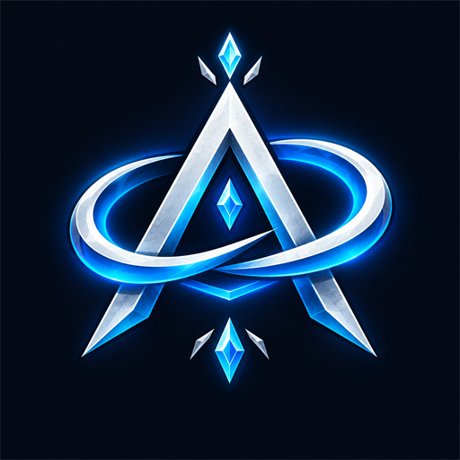

<p align="center"></p>

# AeonUI

Interface and quality-of-life for **WoW Forever** (client 1.60, engine 12.x, Interface `16001`).
Thirty-two modules you can enable one by one, **no dependencies** (LibStub and LibDeflate are bundled).
Built for this client, within the limits of its engine.

Unofficial addon, not affiliated with Blizzard Entertainment. World of Warcraft and WoW Forever are trademarks of Blizzard Entertainment.

## Modules
| Module | What it does | Default |
|---|---|---|
| **Top bar** | Friends and guild online (lists, AFK/DND), 12/24h clock + date + "zzz" while resting, gold, durability, bags, colored FPS/latency + addon memory (Shift-click: free), **Travel menu** (mage teleports and portals, Moonglade, Astral Recall), **hearthstone**. Can hide in combat (FPS/latency can stay visible). Position: top, bottom or **free** (fitted width, movable via `/aeon unlock`). Moves the minimap down so it isn't covered (clients without Edit Mode; on Forever, place it via Edit Mode). Two free slots (left, right) for any info text. | on |
| **Bags** | One window for the backpack and equipped bags, on its own mover: search, client sort, item level on gear, gray items flagged, quality border, cooldowns, free slots and gold. Blizzard bank. | off |
| **Raid utility** | "Raid" button on its own mover, visible in a group: ready check, role check, countdown, target markers, ground markers (secure buttons, usable in combat). | off |
| **Loot** | Themed loot window, under the cursor or on its own mover, quality colors, loot master. Group roll bars (need, greed, disenchant, pass) with time remaining, on the `lootroll` mover. | off |
| **Data panels** | Three free bars on movers `datapanel1` to `datapanel3`, split into 1 to 6 slots: coordinates, quests, mana regen, speed, DPS from the native meter (if the client has it), and the top bar's texts (friends, guild, clock, gold, durability, bags, FPS). Can hide in combat. | off |
| **Automation** | Repair (guild bank first), batch-selling gray items, **quick loot**, **quests accepted/turned in** (Shift to pause, never picks a reward for you), hold ALT to release spirit, friend/guild invites, delete pre-filled, cutscenes skipped, instance reset announced. | on |
| **Reminders** | Out of combat: missing class buff (only if you know the spell), **expected stance/form** (warrior, druid), no pet out, not "Well Fed" in an instance, Shadowform / Righteous Fury (option), low durability, full bags, forgotten stealth (dungeons/raids or everywhere). Stealth and stance: customizable text and color, sound repeated at a chosen interval. | on |
| **Alerts** | "+ Combat / - Combat" (entering, leaving, or both; adjustable text, colors, sound and size), group member death (once per death, own sound and size), combat timer. | on |
| **Nameplates** | Two chevrons attached to the target's health bar (hostile targets only), the left one moves aside during a cast. Color out of combat, in combat, and when another tank has aggro. | on |
| **AeonUI group and raid frames** | Party and raid grids: health, power, name, role, leader, marker, aggro border and border for debuffs dispellable by your class, out-of-range dimming; sort by group, class, role or name; truncated name; raid threshold 5/10/40; click to target. | off |
| **AeonUI action bars** | Six movable bars of Blizzard buttons (icons, cooldowns, keybinds, drag and drop handled by Blizzard code): buttons, buttons per row, size, spacing, opacity, only visible on mouseover; keybind and macro text can be hidden; keybind mode `/aeon kb`; stance and stealth paging on bar 1. Micro menu and bags: hidden, Blizzard style (Edit Mode or mover) or AeonUI style (on their own mover or in the top bar). | off |
| **AeonUI minimap** | Square or round minimap at any size, themed border, zone name (PvP color) and coordinates, scroll-wheel zoom, Blizzard decor hidden, addon buttons grouped under the map (always, on mouseover, never); movable. | off |
| **AeonUI chat** | Themed windows (background, font, flat tabs, side buttons hidden, no fade, adjustable history), history kept across /reload, keywords highlighted with sound, lenient anti-spam, clickable URLs, copy button, short channel names, class color everywhere, timestamps, input box on top or bottom. | off |
| **AeonUI data bars** | Experience bar (resting, hidden at max level) and tracked reputation bar, movable, with text and tooltip; Blizzard bars hidden. | off |
| **AeonUI quest tracker** | Blizzard tracker on a movable holder, adjustable height, themed headers, automatic collapse in combat or in an instance. | off |
| **Movable Blizzard frames** | Cooldown manager (essential, utility, icons and buff bars), player buffs and debuffs on AeonUI movers, without reparenting; each one can stay on Edit Mode. | off |
| **Cooldown manager** | Spell-by-spell settings for the Blizzard cooldown manager: pick the spell per icon, show or hide it on its bar (the following ones shift up), pulsing glow when ready or all the time. | off |
| **AeonUI nameplates** | Replaces the Blizzard skin on nameplates: health (reaction, class, threat in combat), name, level, cast bar with icon, raid marker, debuffs and buffs above, target highlight, adjustable text size. Compatible with the chevrons. | off |
| **Character sheet** | Item level per slot (quality color), average level, a "!" marker on enchantable pieces with no enchant. Same levels on the inspect window, and players' average level in their tooltip. | on |
| **Look** | Character sheet and friends window in the theme (option: flat background, cropped slots, quality border), dark Blizzard panels (option), dark tooltips, class color, hide in combat (units or all), cropped buff and cooldown manager icons; tooltips follow the cursor, unit's target, guild rank, spell/item/aura ID, health bar can be hidden. | on |
| **Clean interface** | Red errors, talking head, tutorials, capture message hidden; spell alert opacity, alerts hidden by class; action bars always visible; Lua errors hidden; native cooldown numbers on every button; cooldown text colored by tier on AeonUI buttons and icons (native formatter). Every changed CVar is restored. | on |
| **Unit frames** | Tweaks to the Blizzard frames: dark mode, health in class color, colored raid names, crossed swords when the target is in combat. | off |
| **AeonUI unit frames** | Replaces the Blizzard frames for player, target, target of target, focus, focus target, pet and boss 1 to 5 with AeonUI frames: health, power, cast bar, auras, name, level, combat/resting/leader markers, raid marker, combo points, totems (movable bar, right-click to destroy). Each unit has its own settings (size, elements); movable via `/aeon unlock`. See "Unit frames". | off |
| **Resource bars** | Health (option), power, combo points and druid form mana in separate bars, each on its own mover: width, heights, text, class color, threshold marker, always visible or only in combat / with a hostile target, opacity out of combat. | off |
| **Swing timer** | One bar per weapon (main hand, off hand, ranged) counting down to the next swing, a separate color when a next-swing attack is queued. Needs the client's `PLAYER_SWING` event: without it, the module is inactive (says so in its options). | off |
| **Raid cooldowns** | In-combat combat res charges for the group in an instance, and your Bloodlust / Heroism lockout. Shows nothing until the client provides this data (Classic content). | off |
| **Quickdraw** | Hold a key: spells, items, macros and mounts in a ring or grid around the cursor, release over one to cast it. Out of combat only (the client doesn't compile the secure code this needs in combat). | off |
| **Other tank** | In a raid, the other tank's health bar, clickable to target them, their debuffs below when the client lets you read them: all, important (boss or dispellable by you), or dispellable only, with stack count. | off |
| **Tracker by ID** | Row of icons for spells and auras chosen by ID: a buff on you or a debuff you put on the target (duration, stacks), otherwise the spell's cooldown; movable. In combat, the game often hides auras. | off |
| **Group finder** | One-click sign-up when a single role is checked (Shift: manually), remembered application note. | off |
| **Cursor and crosshair** | Ring around the cursor, central crosshair, in combat only or always. | off |
| **Away screen** | Away out of combat: interface removed, camera rotating, a banner with the character and how long you've been away; returns on combat or a click. | off |

**Profiles**: shared "Default", one profile per character (one-click copy) or **per specialization**
(automatic switch when you change spec). Export/import as a compressed text string (`AEON2`, LibDeflate;
uncompressed `AEON1` strings are still accepted), full or **per module**: importing a partial string
only changes those parts. Role presets (tank, healer, damage). Sending to the group: nothing is
decompressed or imported before "Yes".

**Languages**: English, French, German, Spanish (Spain and Mexico), Italian, Portuguese (Brazil),
Russian, Korean, Simplified and Traditional Chinese. Besides English and French: machine translation, needs
proofreading. In Russian, Korean and Chinese, the default font switches to the client's own (full character set).

**Setup assistant** (`/aeon setup`): module selection, Edit Mode layout
(apply AeonUI's own, import/export a string), cooldown manager (enable +
layout), recommended Blizzard settings. Everything is reversible: unchecking restores the original value.
The shipped layout is pasted into `NS.PRESET_LAYOUTS` (`Core/Compat.lua`) from an in-game export
(`/aeon setup` > Export, Layout and Cooldown Manager pages); until it's filled in, the
"Apply" button stays grayed out.

**Clean removal**: `/aeon uninstall` asks for confirmation, then restores the Blizzard settings and
turns off the modules on every profile. If AeonUI is disabled in the addon list, the Blizzard settings
are restored on logout. The addon compartment icon (minimap) opens the options (right-click:
unlock).

## Out of scope
- Combat-log swing timers: the combat log is forbidden to addons on this engine. The
  "Swing timer" module goes through `PLAYER_SWING` when the client has it.
- Damage meter: ForeverMeter, a separate addon, already does this (`C_DamageMeter`).

## Installation
Copy the folder to `World of Warcraft/_classic_beta_/Interface/AddOns/AeonUI/`
(the folder must be named `AeonUI`, like the `.toc`). On first launch, a window
starts the setup assistant.

## One-click install
`/aeon setup`, "Quick install" page: three base profiles, one per role (`/aeon install
dps|heal|tank`), plus a **Light** button (comfort modules only, Blizzard frames kept,
applied to the current profile). One click switches to the "Damage", "Healer" or "Tank" profile (created from
the defaults if missing), turns on every AeonUI module (unit frames, nameplates, group,
action bars, minimap, chat, data bars, quest tracker, movable Blizzard frames),
applies the recommended settings, imports the "AeonUI" Edit Mode layout and lays out the
role's movers:
- **Base (every role)**: center column below the character (cooldown manager buff
  icons, essential and utility cooldowns, cast bar, three action bars),
  player on the left and target on the right, pet and target-of-target lined up below, focus on
  the far left, buff bars on the far right; minimap and quest tracker top
  right, buffs and debuffs to the left of the minimap, micro menu and bags bottom right, bars 4 and
  5 vertical on the right edge.
- **Damage**: group and raid in columns on the left, detached cast bar, threat on nameplates.
- **Healer**: player and target spread apart, raid in an 8 × 5 grid (party in a row) under the
  cooldowns, cast bar under the player frame, health in percent, dispel, range, ally
  health on nameplates.
- **Tank**: like Damage, aggro on group frames, co-tank above the focus.

`/aeon install complete|light [dps|heal|tank]` applies a preset to the active profile without
switching it (**light** = Blizzard frames kept, comfort modules only). A module handed to a
third-party addon keeps its setting without turning on.
Options > Profiles: apply a role to the current profile, or switch to a role's base profile.
Module pages and the module list are sorted alphabetically.

## Options window
`/aeon` (or the addon compartment icon) opens the AeonUI window; a second `/aeon` closes it,
and so does Escape. Options > AddOns > AeonUI now holds just a button that opens it.

Every setting, page by page, with its default value: [docs/options.md](docs/options.md).
This reference is generated from the window itself; regenerate it after any options change:
`luajit tools/generate_options_doc.lua frFR > docs/options.md` (`enUS` for English).
- Left column: General, Modules, Profiles, Maintenance, then one page per module with a green
  (on), gray (off) or orange (handed to a third-party addon) marker.
- Search at the top of the column: results replace the list; a click opens the page, picks
  the tab and highlights the setting.
- Dropdown lists (font and bar texture previews), exact value typed to the right of
  each slider, long explanations on hover.
- An indented setting is grayed out while the checkbox it depends on is unchecked; a whole page for a
  module is grayed out while the module is off.
- Tabs per unit (unit frames), per bar (action bars), per panel, per data bar,
  per style rule (nameplates) and group / raid / indicators (group frames). "Copy settings
  from" copies another unit or another bar.
- "Reset this module", resetting and deleting a profile all ask for confirmation.
  Turning off a module that only restores Blizzard frames on reload offers "Reload".
- Window height adjustable via the handle in the bottom right; fixed width.

## Unlock
`/aeon unlock` puts a colored overlay on every movable AeonUI frame (reminders, alerts,
combat timer, other tank bar, top bar in free position). The frame itself
is never made movable: you drag the overlay, then the frame joins it out of combat.
- Drag: on release, the overlay snaps to the screen's edges and center and to other overlays (8 px). Shift while dragging turns off snapping.
- Arrow keys: 1 px on the selected (clicked) overlay, Shift + arrows: 10 px. Other keys pass through to the game.
- Right-click an overlay: the module's options page. Shift + right-click: default position.
- Toolbar at the top of the screen: grid, "Show" filter (every frame or just one module's), "Reset all" (with confirmation), "Lock". Opening move mode closes the options window.
- **Anchoring to another element**: select an overlay, "Anchor to..." in the top panel, then click the target. The element stays in place and now follows its target (closest side). Dragging an anchored element changes its offset, not its anchor. "Detach" gives it back to the screen without moving it. An anchor that would create a loop is refused.
- Anchored element: "Width" / "Height" take on the target's (and follow them); "Lock X" / "Lock Y" keep that axis on screen while the other follows the target (cross anchoring). Missing target (module off): fallback position, remembered when anchoring and on every move.
- "Center": centers the element on screen, offset by half a pixel if its width requires it (crisp edges).
- Alignment grid (16 or 32 px), pixel-perfect scale, and the "Interface scale" slider (× 0.5 to 1.5) in Options > General. Positions are rounded to the physical pixel.

## Unit frames
The "AeonUI unit frames" module builds its own frames (secure buttons: left click
targets, right click opens the menu) and hides the Blizzard ones (player, target, target of target, focus, pet,
combo points, player cast bar if its own is checked). Blizzard frame events
are cut: after disabling the module, a `/reload` fully restores them.
- Per-unit settings: show, width, height, name, level, power bar and its height,
  cast bar and its height, "detached cast bar" (its own `uf_castbar_<unit>` mover
  and its width), auras and icon size, combo points (player).
- Shared settings: class color (reaction otherwise), health in a red-yellow-green gradient (engine curve, even in combat), health and power text (value,
  percentage, value | percentage, value / max, missing, none), bar texture (with LibSharedMedia).
- Secret values (Midnight): health, power, durations and auras go straight to the widgets; nothing
  is compared in Lua. Auras go through the engine's aura container when the client
  offers it, otherwise through homemade debuffs. `/aeon diag`, "Unit frames" line, tells you what the client exposes.
- Per-frame text formats: free text with the tokens `[cur]`, `[max]`, `[perc]`, `[missing]`,
  `[status]` (example `[cur] / [max] ([perc])`). Secret values go to the engine without being read.
- Per-frame debuff filter: all, mine, important, dispellable, boss. White and
  black lists of spell IDs shared by unit frames, nameplates and the other tank frame.
- Boss 1 to 5: a single settings block, one mover per boss. Focus target: off by default.
- Per-unit out-of-combat fade: the frame drops to the chosen opacity while nothing is happening, and
  returns to full in combat, with a target, during a cast, injured or moused over.
- Positions: keys `uf_player`, `uf_target`, `uf_targettarget`, `uf_focus`, `uf_focustarget`, `uf_pet`,
  `uf_boss1` to `uf_boss5` in the unlock tool.

## Nameplates
The "AeonUI nameplates" module puts an AeonUI frame on every Blizzard nameplate (anchored,
never reparented: the plate is protected in combat) and makes the Blizzard skin invisible. After
disabling it, a `/reload` restores the Blizzard nameplates. Settings: width, height, name, level,
health text and format, cast bar and height, debuffs, size and filter (mine by default), ally health bar,
target highlight (accent border, other plates dimmed), threat color
(`UnitThreatSituation`, responds in combat on Forever; secret → reaction color), class
color, Blizzard hiding. Nameplate auras always go through the homemade debuffs (a nameplate's unit
changes, and the engine's container wants a fixed unit).
Style filters: five rules checked in order, the first enabled one that matches
styles the nameplate. Conditions: is the target, is casting, in combat, reaction, classification (normal, elite,
rare, boss), quest-related, health below x%, names. Actions: bar color, glow, size,
opacity, hide. A secret condition makes the rule fail (never an error in combat).

## Group and raid
Two secure Blizzard headers (`SecureGroupHeaderTemplate`) create and sort the buttons out of
combat; AeonUI skins each button as it's created. Dispel: a per-class Classic table (priest
Magic/Disease, paladin Magic/Poison/Disease, shaman Poison/Disease, druid Curse/Poison, mage
Curse, warlock Magic through their felhunter). Threat: `UnitThreatSituation(unit)` 2 in orange,
3 in red, as a border or a glow. Center icon: ready check (the result stays for 6s), summon,
resurrection in progress. Incoming heals and absorbs at the end of the health bar when the client provides them.
In a raid, optional main tank and main assist frames (movers `uf_tank`, `uf_assist`): a
unit can appear there in addition to the raid. Range: `UnitInRange` every 0.25s.
Settings: name length (truncated in UTF-8, 0 = full), raid sort by group, class, role
(`groupBy = "ASSIGNEDROLE"`) or name, and raid threshold (5, 10 or 40 members): up to the threshold a
raid keeps the party layout (one column or one row per group of 5, the group header
shows the raid members), beyond it the raid grid takes over (`[@raidN,exists]`).

## Action bars
`ActionBarButtonTemplate` buttons (Blizzard's own rendering, safe against secret values) on
`SecureHandlerStateTemplate` bars. Bar 1 follows `[bar:n]` and `[bonusbar:n]` (stances, stealth) via a
restricted handler that sets `actionpage` on each button. Blizzard keybinds
(`ACTIONBUTTONn`, `MULTIACTIONBARnBUTTONn`) are redirected via `SetOverrideBindingClick`, out of combat.
Replaced Blizzard bars are hidden without being reparented (Edit Mode). Stance and
pet bars: Blizzard's own, movable. Keybind mode (`/aeon kb`): hover an AeonUI button
and press a key to bind it to the button's Blizzard command; Escape on the button clears it,
Escape elsewhere closes the mode, which also closes when entering combat.

## Minimap, chat, data bars, quest tracker
These Blizzard frames are Edit Mode systems: AeonUI never reparents them. `Minimap`
and `ObjectiveTrackerFrame` are re-anchored to a movable AeonUI holder, a
`SetPoint` hook takes back control if Blizzard repositions them; the decor is hidden by `NS.HideRegion`
(a `Show` hook). Chat keeps Edit Mode's position and size; AeonUI wraps `AddMessage`
per window (URLs, short channel names), sets the theme font and hides the textures. The
experience and reputation bars are AeonUI's own bars; the Blizzard bars are hidden without
reparenting. Everything comes back on `/reload` after disabling.

## Compatibility with other interface addons
Other interface addons can be installed alongside AeonUI. When one of them is loaded, the modules
that touch the frames it replaces (Look, Unit frames, Nameplates, Away screen…) stay off and show up
grayed out as "(handled by another addon)" in the options and the assistant. The user's setting is
kept: without that addon at the next login, these modules come back on their own. The other modules
run normally. `/aeon diag` lists the detected third-party addons.

## Secret values (Midnight)
When the client offers them, AeonUI hands off the display of a secret value to the engine instead of
reading it: health color via a curve (`UnitHealthPercent`), out-of-range dimming via
`SetAlphaFromBoolean`, cooldown text via the native formatter, hidden unit identity detected
via `C_Secrets.ShouldUnitIdentityBeSecret`. Without these APIs, each function falls back to a
Lua calculation when the value is readable, or to a neutral display otherwise. `/aeon diag`, "Midnight" line,
tells you what the client exposes.

## Design rules
- Each module is isolated: an error stops only that module, with a message.
- Nothing secure is changed in combat: changes wait until combat ends.
- No combat log; no comparison on a secret value.
- Everything is reversible: turning off a module restores the Blizzard state (styles, colors, CVars).
- WoW Forever 1.60 writes account SavedVariables but never reads them back: the settings table is stored in `g_addonCategoriesCollapsed` (Blizzard_AddOnList's own save, `WTF/SavedVariables/`, reloaded on startup) and copied into `AeonUIMirror1..8` CVars (survive `/reload`). If the save comes back empty, these copies replace it.
- No restricted snippets (`_onstate-*`, `initialConfigFunction`, `SecureHandlerExecute`): this engine has no `loadstring`, nothing compiles in the restricted environment. Bar paging via `RegisterAttributeDriver`, group buttons skinned via a `SecureGroupHeader_Update` hook.

## Out-of-game verification
```
tests/run.sh
```
Syntax, the headless suite (303 tests against a client mock) and `.toc` ↔ files consistency.

## In-game checklist (the mock doesn't replace the client)
1. `/reload` then `/aeon diag`: no Lua errors (`/console scriptErrors 1`), and note the missing APIs.
2. Bar: click Friends, Guild, Clock, Durability, Bags; Hearth casts the stone; mage: Travel opens the teleports.
3. Vendor: repair and selling announced. Quest NPC with the option enabled: accepted / turned in.
4. Death in a dungeon: "Release Spirit" requires holding ALT.
5. Without your class buff outside town: reminder + sound; disappears once the buff is applied.
6. Entering combat: "+ Combat"; the hostile target has its chevrons, which move aside while it casts.
7. Character sheet: item levels on the slots.
8. Enable "Unit frames": target's health in their class color; turning it off restores green.
9. In combat, uncheck the top bar: "when combat ends" message, applied afterward.
10. `/aeon setup`: Layout page, "Export" on a custom layout returns a string; "Import" recreates it under the name AeonUI. Cooldown Manager page: the checkbox toggles `cooldownViewerEnabled`. Settings page: check/uncheck a CVar.
11. Options > Profiles: Export, paste the string on another character, Import: same settings after reloading.
12. Disable AeonUI in the addon list: message; after logging out and back in, `/console showTutorials` is back to its original value.
13. AeonUI addon compartment icon: left-click opens the options, right-click unlocks.
14. Group finder tool, applying with a single role: automatic sign-up; with "remembered note", the text comes back on the next application.
15. Raid with another tank, "Other tank" module: their debuffs appear below the bar, or the row stays empty with no Lua error.
16. Top bar + minimap: on this client (Edit Mode), AeonUI doesn't move the minimap; place it under the bar via Edit Mode.
17. Group, "Unit frames" module turned off after being enabled: members' health bars go back to Blizzard green.
18. Rogue with the Poisons passive and a weapon with no poison, out of combat: "poison" reminder shown.
19. Vendor, guild bank allowed but empty: repair paid from personal gold, matching message.
20. Several-minute combat with the top bar: no freeze when leaving combat.
21. In combat, hostile target: `/dump C_NamePlate.GetNamePlateForUnit("target"):IsProtected()`; the chevrons follow the nameplate whatever the answer.
22. Assistant finished, a setting changed, wait 5s, `/reload` then quit and relaunch the game: no assistant, setting kept, `/dump g_addonCategoriesCollapsed.AeonUI == AeonUIDB` = true.
23. `/aeon uninstall`: confirmation window; No changes nothing; Yes restores the CVars and turns off the modules, also on another profile (`/aeon status` after switching profile).
24. Top bar, "Hide in combat" checked: in combat, only FPS/latency stays; unchecking "Keep FPS and latency visible in combat" hides those too. "Free" position + `/aeon unlock`: drag the bar, `/reload`, position kept; "Reset the bar position" puts it back on top.
25. Raid, other tank with debuffs: the "Important" filter keeps only boss/dispellable ones, the stack counter shows up; no Lua error on secret values.
26. Rogue, stealth reminder: custom text and color shown; "Repeat the sound" at 5s replays the sound while the reminder stays; "Everywhere" shows it outside an instance.
27. Alerts, "Entering only": no "- Combat"; text, color and sound chosen play on entering combat.
28. `/aeon unlock`: one overlay per movable frame (reminders, alerts, timer, other tank, top bar if "Free"); drag an overlay near the screen's center: it snaps there; with Shift held it stays where it's dropped; click an overlay then arrows: moves by 1 px, Shift + arrows 10 px; right-click: default position; the tooltip gives the point and coordinates.
29. After an update, positions saved earlier (reminders, alerts, free bar) are honored without redoing anything; `/reload`: positions kept.
30. Options > General: "Text outline" changes AeonUI text without /reload; "Background color" and "Border color" change the overlay and the frames; "Pixel perfect scale" unchecked then rechecked: the interface changes scale and comes back; crisp 1px borders; "Interface scale" slider at 1.20: everything grows out of combat, back to 1.00 restores the scale.
31. Options > General, 32px grid then `/aeon unlock`: grid visible, disappears when locking; "Reset all frame positions": confirmation, then every frame goes back to default.
32. Entering combat while unlocked, top bar in "Free" position: dragging its overlay does nothing, no "action blocked" message; on leaving combat, a drag works.
33. `/aeon diag`: "Third-party addons loaded: -" line.
34. `/aeon diag`: "Unit frames" line: note the missing APIs (SetTimerDuration, AbbreviateNumbers, UnitHealthPercent, CustomAuraContainerTemplate); each absence has its fallback.
35. Enable "AeonUI unit frames": Blizzard frames disappear, AeonUI frames appear; target a hostile NPC: red frame, name, level, health that moves; target a player: class color; in combat: health and power stay live, no "action blocked" or "secret value" error.
36. Cast bar: an NPC casting → bar filling; interruption → red then disappears; your own cast on the player frame. Auras: target's debuffs visible, tooltip on hover. Rogue or druid: combo point bar under the player frame.
37. `/aeon unlock`: the five overlays move, position kept after `/reload`. Disable the module: reload message; `/reload` restores the Blizzard frames.
38. Enable "AeonUI nameplates": AeonUI bars on the plates, Blizzard skin invisible; target: accent border, others dimmed; in combat on an NPC: red with aggro, orange/yellow otherwise, no "secret value" error; NPC casting: bar with icon, gray if uninterruptible; debuffs above; the "Nameplates" module's chevrons stay; disable: message, `/reload` restores the plates.
39. Enable "AeonUI group and raid frames" in a party: AeonUI grid, Blizzard frames hidden; out-of-range member dimmed; priest: a Magic debuff on a member → blue border; tank with aggro → red border; switch to a raid: raid grid by groups; click targets the member.
40. Enable "AeonUI action bars": three AeonUI bars, Blizzard bars hidden; keys 1-= cast bar 1's spells; druid/rogue: form or stealth switches the page; drag a spell from the spellbook onto a button; `/aeon unlock` moves the bars; disable: message, `/reload` restores the Blizzard bars.
41. Enable "AeonUI minimap": square map on a movable holder, Blizzard decor hidden, zone name above (PvP color), scroll wheel = zoom; coordinates option; addon buttons (LibDBIcon) in a row under the map on mouseover; disable: message, `/reload` restores the Blizzard minimap. Check that Edit Mode doesn't put it back in place (note it otherwise).
42. Enable "AeonUI chat": background and font in the theme, flat tabs, side buttons hidden; a URL in the chat becomes clickable and opens in the copy box; `[c]` on hover copies the window; "[2. Trade]" becomes "[2]"; timestamp follows the option; input box on top if checked.
43. Enable "AeonUI data bars": XP bar with resting (non-max character), tracked reputation bar, Blizzard bars hidden; `/aeon unlock` moves them.
44. Enable "AeonUI quest tracker": Blizzard tracker on the holder, adjustable height, headers with no background; "Collapse in combat" collapses then reopens it; disable: `/reload` restores the tracker.
45. Look > "Dark Blizzard panels": character sheet, spellbook, vendor darkened; unchecking restores the original art.
46. `/aeon setup` > "Quick install": complete preset + healer role > "Install now": every AeonUI module turned on, frames laid out per the layout (bars at the bottom, player left of center, target on the right, group on the left, minimap and quest tracker on the right), CVars applied, "Installed" message; `/reload` then check everything is still in place.
47. `/aeon install light`: AeonUI modules off, Blizzard tweaks turned back on; `/aeon install complete tank`: co-tank on, aggro border on group frames.
48. Options > Profiles: "Create a role profile for this character" with Tank: new active profile named "Character - Realm - Tank", Default unchanged when going back to it.
49. Look: check "Default tooltips follow the cursor", "Spell, item and aura IDs": hovering an NPC at the cursor, ID under a spell in the spellbook and an item in the bag; guild member: "[Rank]" after the guild; a player targeting you: "Target: >> YOU <<".
50. Clean interface > "Cooldown numbers": seconds written on the bars' cooldowns; unchecking removes them.
51. Action bars: bar 2 "Only show on mouseover": invisible, appears on mouseover and while dragging a spell; `/aeon kb`, hover button 3 of bar 1, Shift-F: the key casts the spell; Escape on the button clears it; entering combat closes the mode.
52. Unit frames: "Fade out of combat" on the player: frame faded at rest, full in combat, with a target, injured or moused over; in a dungeon with a boss: boss frames on the right, no Lua error.
53. Away screen (enabled): `/afk` out of combat: interface removed, camera rotating, banner and timer; getting attacked or `/afk` again: everything comes back with no "Interface action failed" message.
54. `/aeon diag`: "Midnight" line present, each API marked yes or no.
55. Clean interface > "Colored cooldown text": AeonUI bar cooldowns in yellow, red with one decimal under 3s, minutes in white; threshold at 0: no more red; unchecking restores plain numbers.
56. Unit and group frames > "Health color from red to green": color that follows health in combat with no Lua error; unchecking restores the class color.
57. In a group, in combat: an out-of-range member is dimmed (before: stayed full when range was secret).
58. Unit frames > target, health format `[cur] / [max] ([perc])`: correct text, including in combat, with no Lua error.
59. Unit frames > target, "Mine" filter: only your debuffs remain; nameplates: same by default.
60. Aura lists: a blacklisted ID disappears from unit frames, nameplates and the other tank frame.
61. Ready check in a group: waiting icon then ready or not ready on each frame, cleared 6s after it ends.
62. Heal cast on a member: green bar at the end of their health during the cast; shield: white bar.
63. Raid with an assigned main tank, "Main tank frames" option: their frame appears at the `uf_tank` mover.
64. Unit frames > player, "Portrait": portrait to the left of the frame; target: to the right.
65. Nameplates > Style filters, rule 1 "Is casting: yes", glow: a casting enemy gets surrounded by a halo, which fades when it ends.
66. Rule "Health below 30%", size 1.5: the plate grows at the end of combat; in combat, note whether the rule holds (health secret or not).
67. Rule "Names: totem", hide: totem nameplates disappear.
68. Data panels enabled: panel 1 bottom left with coordinates (that move while walking), speed (100% on foot), regen, quests.
69. Panel 3, DPS slot, in combat: a number or a dash (tells you whether Forever exposes `C_DamageMeter`).
70. Top bar, "Free slot on the left" set to Coordinates: the coordinates appear after the guild.
71. Chat, `/reload`: the last lines come back under "Previous session"; "Clear history" removes them.
72. Chat > keywords `tank`: a message containing it is highlighted in orange, with a sound (at most every 5s).
73. Chat > anti-spam: the same message repeated in trade chat, even with different capitalization or punctuation, only shows up once a minute.
74. Loot enabled: the AeonUI window opens under the cursor, quality in color; click loots, Escape closes it.
75. Group roll: a bar with icon, name, time remaining and need, greed, disenchant, pass buttons.
76. Hovering a player out of combat: "Item level" line added to their tooltip after a short delay.
77. Inspecting a player: each item's level on their slots and the average at the top of the window.
78. In a group, raid utility enabled: "Raid" button at the top; ready check, countdown, marker on the target, ground marker placed then removed with right-click.
79. Bags enabled, B key: a single AeonUI window; B or Escape closes it; vendor: it opens and closes with them.
80. Bags: coin value on gray items, level on gear, search dims the other items, "Sort" tidies the bags.
81. Bags: right-click a potion in combat, it gets drunk with no Lua error.
82. Options, main page: type "loot" in the search, clicking the result opens the Loot page.
83. `/aeon unlock`, click a mover: X / Y box at the top; scroll wheel moves by 1px (Shift: sideways, Ctrl: 10px); typing a value then Enter places the frame.
84. In a group, Options > Profiles "Send this profile to my group": the other player gets a prompt and, on "Yes", takes the profile.
85. `/aeon`: AeonUI window, movable by its title bar, height via the handle; `/aeon` again or Escape closes it. Options > AddOns > AeonUI: "Open AeonUI options" button.
86. Left column: green marker on active modules, gray on off ones, orange on a module handed to another addon; enabling a module from the Modules page updates the marker.
87. Search "width": results "AeonUI unit frames > Target > Width"…; a click opens the Target tab and highlights the slider.
88. General > "AeonUI font": dropdown list, each font written in its own font; scroll wheel if the list overflows. "Text size" slider: typing 14 then Enter applies 14; typing 40 applies 18.
89. Automation, uncheck "Repair automatically at vendors": "Use guild bank funds first" grays out. An off module's page: everything grayed out except "Enable".
90. Unit frames, Focus tab, "Copy settings from: Target": width, height, elements copied over; "Show this frame" unchanged.
91. Profiles: "Reset the current profile to defaults" and "Delete the current profile" ask for confirmation; No changes nothing. "Reset this module" (top right of a page) too.
92. Turn off AeonUI minimap (or Unit frames, Action bars…): "Reload / Later" window.
93. `/aeon unlock`: toolbar at the top; "Show: Loot" leaves only the Loot module's overlays; right-click an overlay opens its options page; Shift + right-click resets it to default; "Lock" exits the mode.
94. Anchoring: power bar (Resource bars) "Anchor to..." the player frame; move the player frame, the bar follows; "Width" checked: same width; turn off AeonUI unit frames: the bar stays at its fallback position; `/reload` then fully closing the game: everything is kept.
95. Profile by spec: link a spec to another profile (Profiles > Profile by specialization), change spec: the profile switches and the chat announces it.
96. Export per module: uncheck everything but one module, export (an `AEON2:` string), import on another character: only that module changes.
97. Diagnostic: check for `C_SwingTimer`, `GetSpecialization`, `GetActiveTalentGroup`; Swing timer inactive if `C_SwingTimer` is missing.
98. Quickdraw: SHIFT-Q key, entries added from the cursor; out of combat releasing it casts the hovered entry; in combat the key does nothing.
99. Look "Character sheet and friends window in the theme": flat background, quality borders; unchecking restores the Blizzard art.
100. Client in German, Russian or Chinese: translated options window, readable characters.

## License
© 2026 dldvlpr, all rights reserved (see `LICENSE`). Bundled libraries, under their own license: LibStub (public domain) and LibDeflate
(zlib license, `Libs/LibDeflate/LICENSE.txt`).
